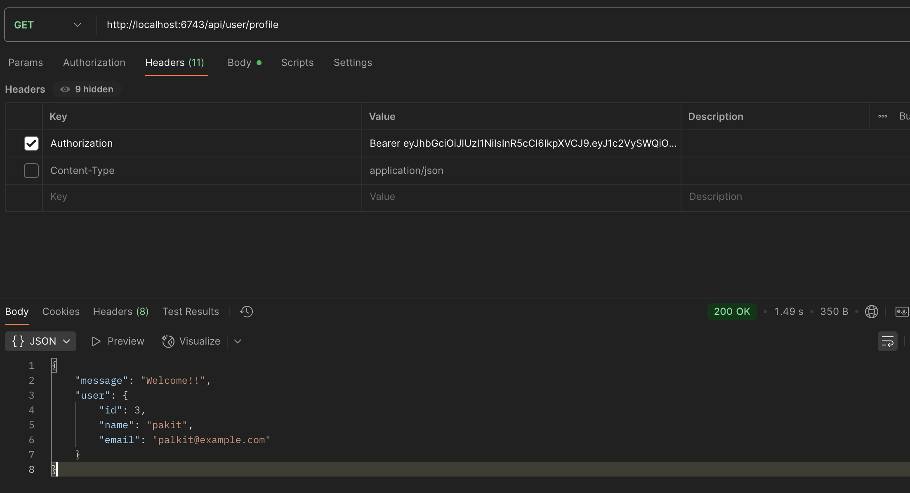
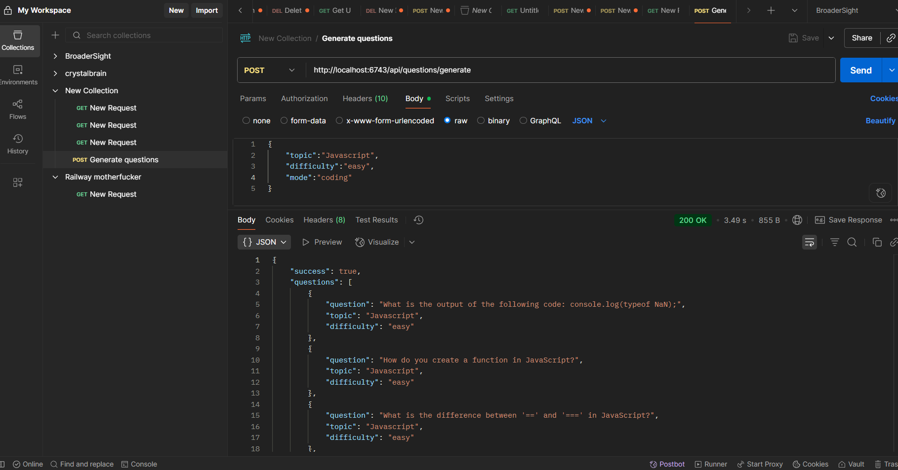

AI_INTERVIEW PREPARATION
# AI Interview Question Generator
This project is a simple Node.js + Express server that uses OpenAI API to generate interview questions. You can give inputs like **topic, difficulty, and mode**, and the server will return AI-generated questions. 

--- ## 🚀 Features 
- Generate interview questions using AI 
- Supports topic, difficulty, and mode
- JSON response format (easy to use with frontend)
- Simple REST API (can be tested with Postman or Thunder Client)
--- 


## ⚙️ Setup & Run 

### 1. Clone the project
```bash
    git clone git@github.com:pransh1/AI_INTERVIEW_PREPARATION.git
    cd AI_INTERVIEW_PREPARATION
```

### 2. Install the dependencies
```bash
     npm install
```

### 3. .env file
Inside the project create a new file .env and add all the recommended paths that are given in .env.sample file 
  
### 4. Start the server 
```bash
npm start 
```
  
### 5. Some Screenshots 
 


 

## THANK YOU FOR READING!
